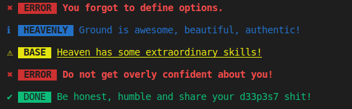

## Install

```sh
npm install juuso-cli-alerts
```
## Usage 

```js
const alert = require('juuso-cli-alerts');

// Provide the type, msg, and name options
alert({type: `info`, msg: `Ground is awesome, beautiful, authentic!`, name: `HEAVENLY`});

alert({type: `warning`, msg: `Heaven has some extraordinary skills!`, name: `BASE`});

alert({type: `error`, msg: `Do not get overly confident about you!`});

alert({type: `success`, msg: `Be honest, humble and share your d33p3s7 shit!`, name: `DONE`})
```

## API 

### alert(options)

#### > options 

Type: `object`<br>
Default: `{}`

You can specify the options below.

#### > type 

Type: `String` <br>
Default: `error`

#### > msg

Type: `String` <br>
Default: `You forgot to define options.`

#### > name

Type: `String` <br>
Default: ``